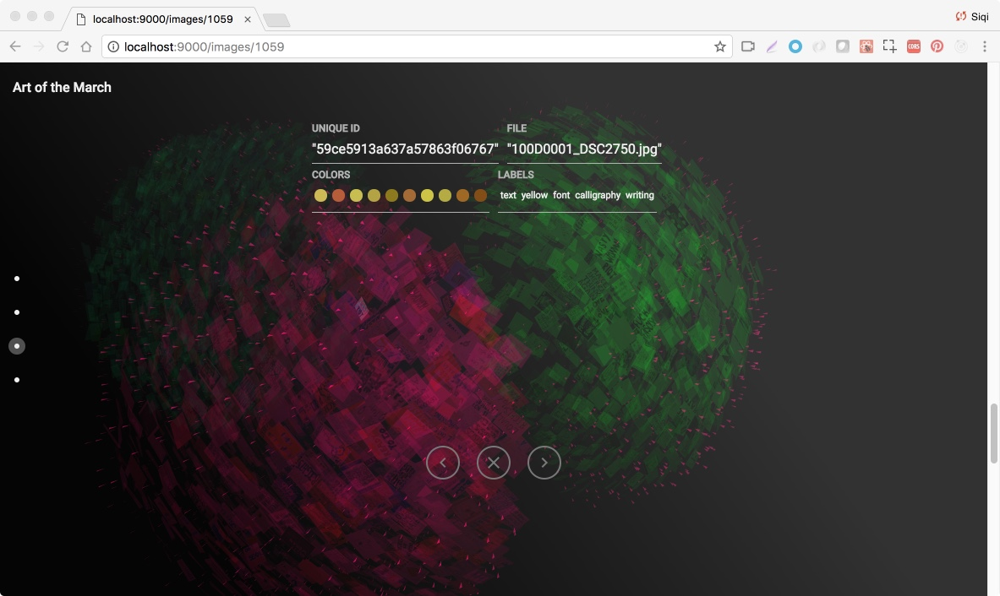
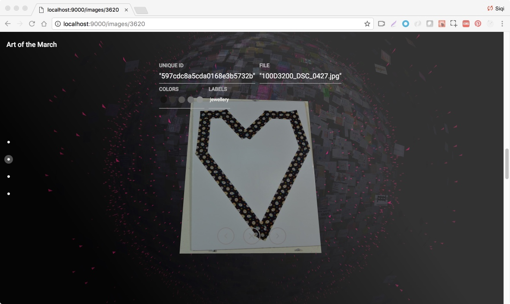

This project focuses on the representation of political dissent, specifically through the 6,000 signs collected from the Boston Women’s March. Working with Dietmar Offenhuber, Navarjun Grewal, and a team of other researchers at Northeastern University, I’m developing an interface that facilitates the visual exploration of these signs. Work is underway to categorize and group these signs, based on dimensionality reduction and machine learning clustering techniques, revealing a picture of the broad range of political concerns represented at the protest. [Teaser link here](http://www.artofthemarch.boston/)

