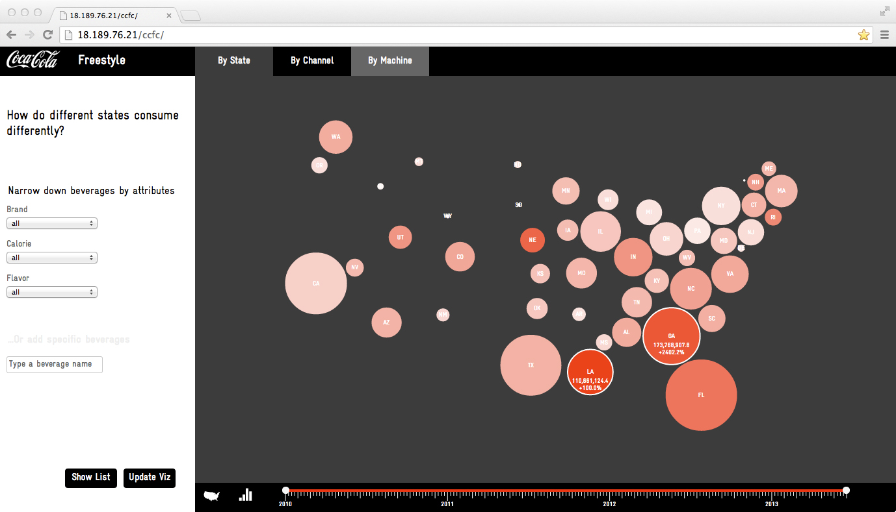
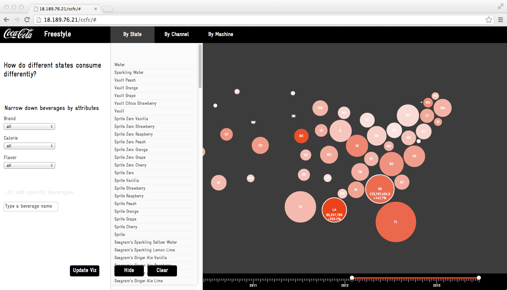
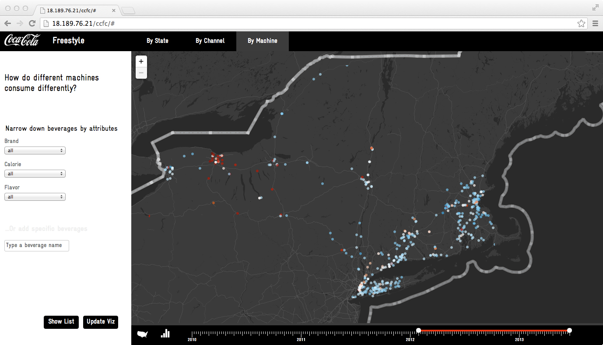
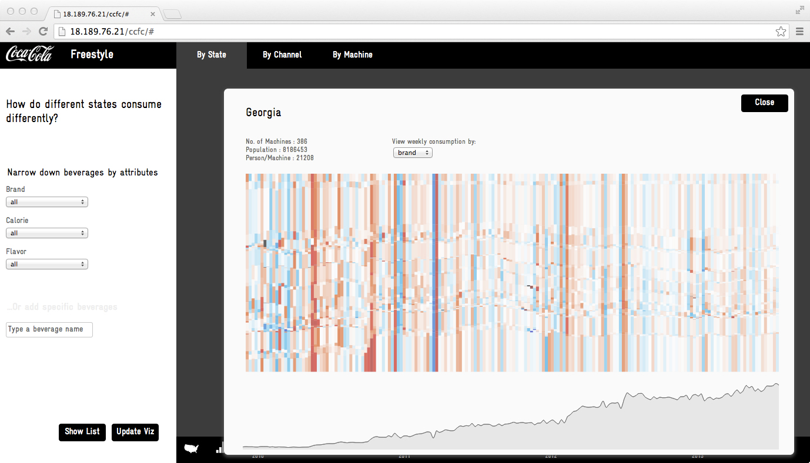

The consumption patterns of millions of consumers is made legible in this collaboration with Coca Cola’s marketing and development team. I designed a software prototype for a “data browser” that allows unrestricted visual exploration of behavioral data at a range of spatial and temporal resolutions. This tool can be generalized for many different kinds of data.

<iframe src="//fast.wistia.net/embed/iframe/mrftsarsn7?videoFoam=true" allowtransparency="true" frameborder="0" scrolling="no" class="wistia_embed" name="wistia_embed" allowfullscreen mozallowfullscreen webkitallowfullscreen oallowfullscreen msallowfullscreen width="640" height="400"></iframe>

