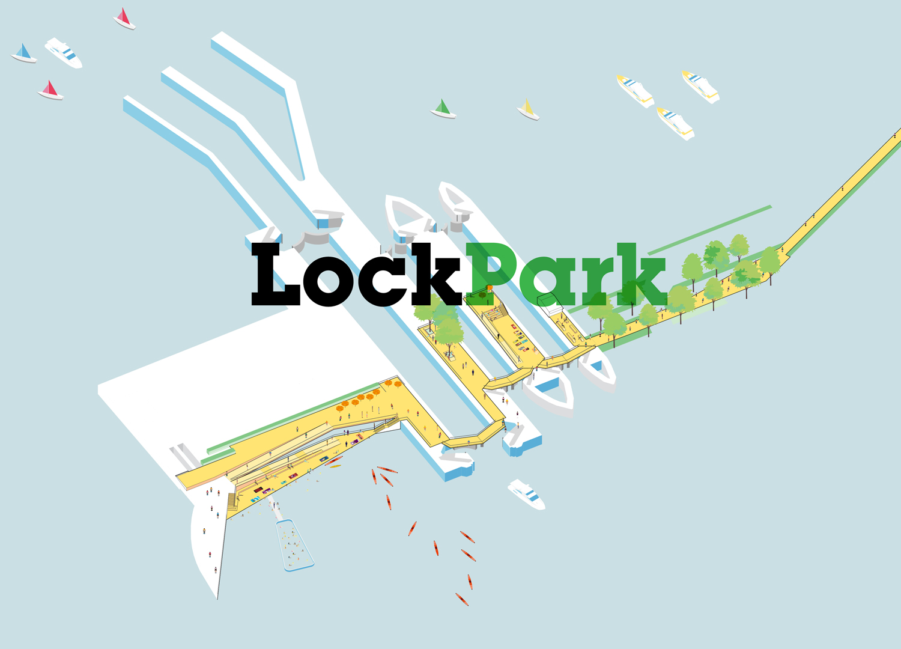
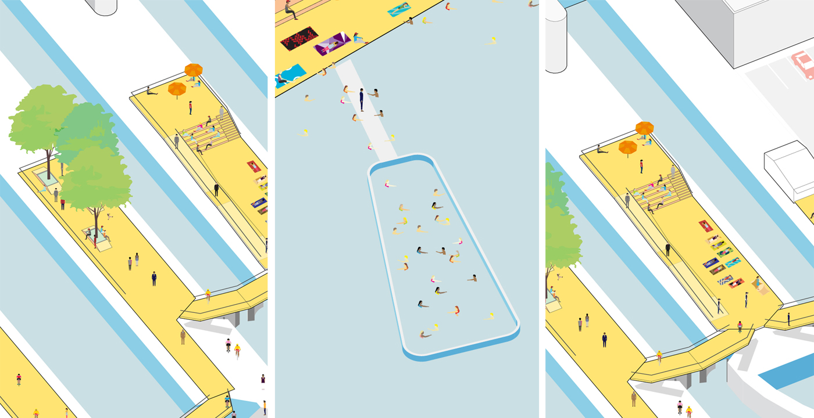
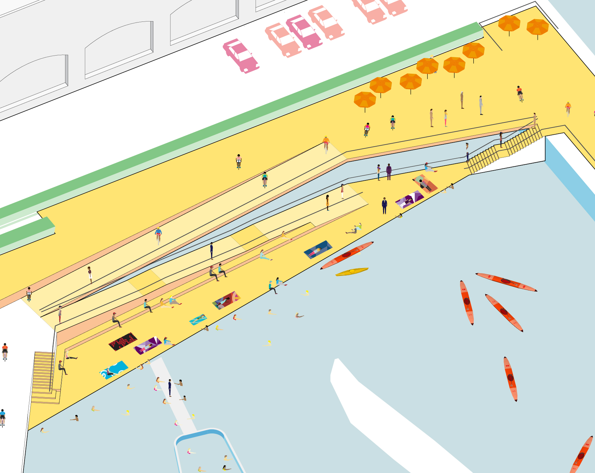

This collaboration between Utile and Spurr envisions a new signature open space on the Charles River locks that separate the river from Boston Harbor. As a part of the BSA-sponsored Green Links competition, “LockPark” fills an important missing link in Boston’s bike and pedestrian network. Swinging decks with carefully calibrated geometry cleverly resolve the need to bridge across active flood control gates; they also form artificial topography that creates opportunities for a variety of recreational experience. 

