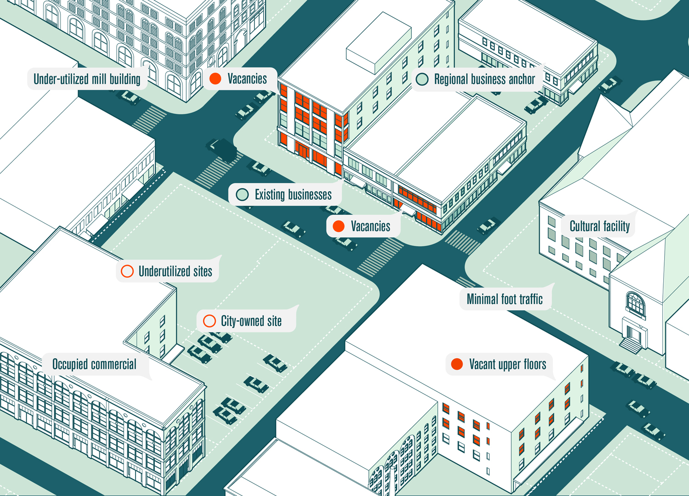
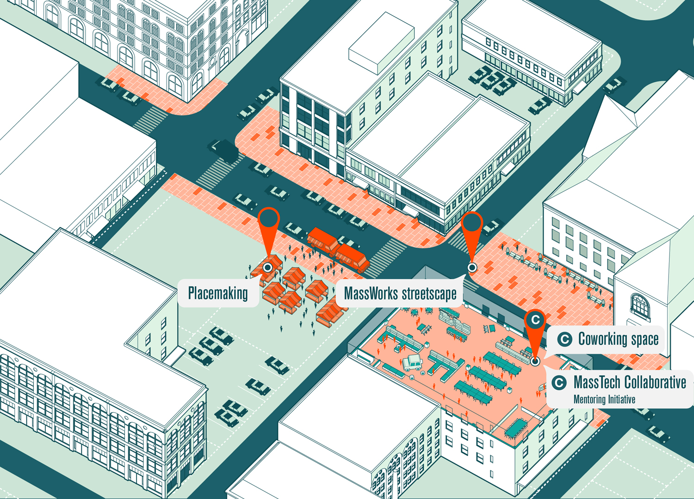
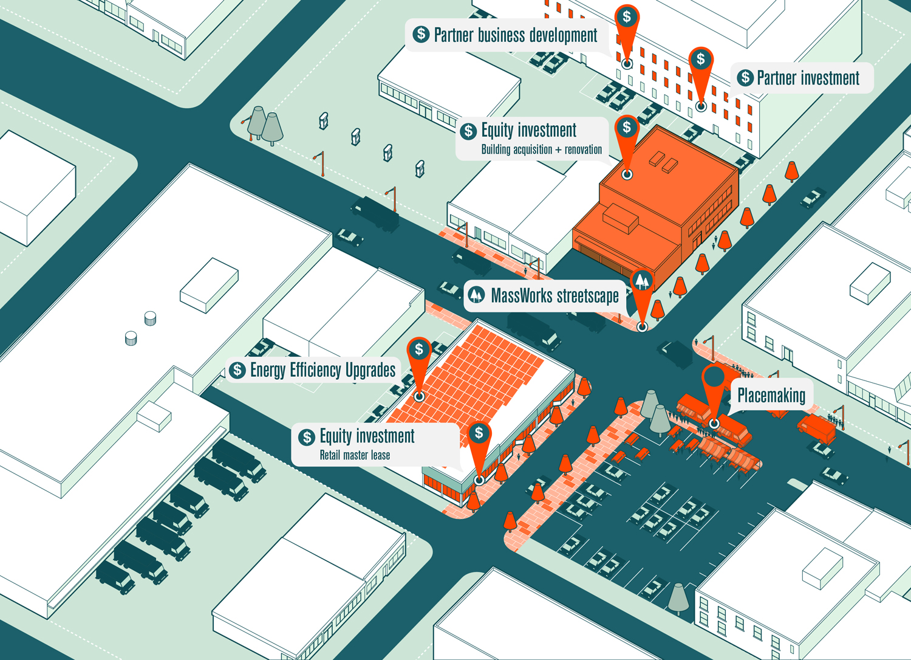
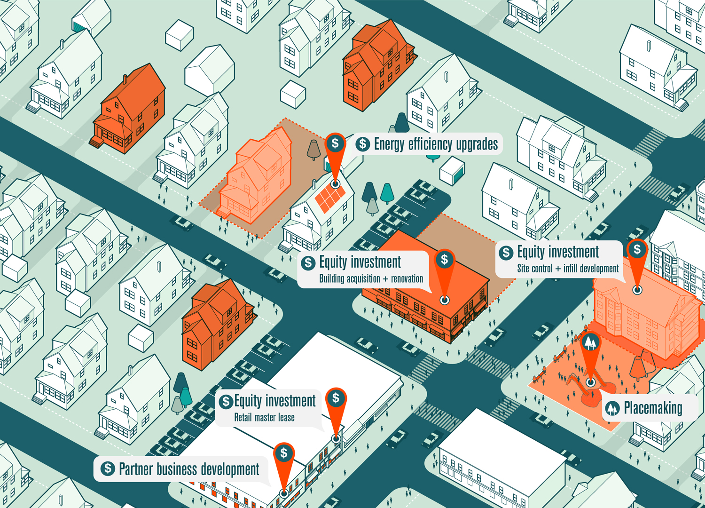

I worked with the leadership of MassDevelopment, Massachusetts's economic development agency, to develop a set of tools to publicize its [Transformative Development Initiative (TDI)](https://www.massdevelopment.com/what-we-offer/key-initiatives/gateway-cities/). TDI unifies a number of investment tools and outreach strategies under a single umbrella, and aims to jumpstart economic revitalization in small-to-medium-sized post-industrial cities with well-coordinated, geographically targeted, and highly visible investments.

As part of the initiative, I also developed a digital product for mapping, tracking, and visualizing economic development activities across ten key “gateway” cities across the state.

	<iframe src="https://www.useloom.com/embed/c451cb351c2b4698b27ae31684a2ecfb" frameborder="0" allowfullscreen></iframe>

