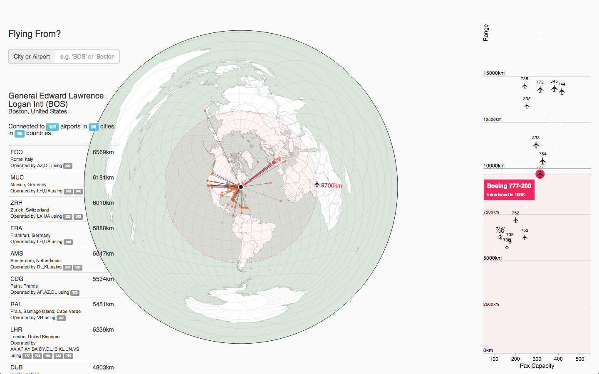
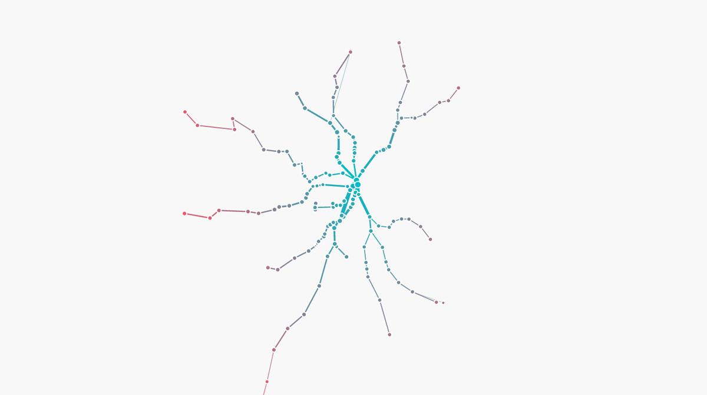
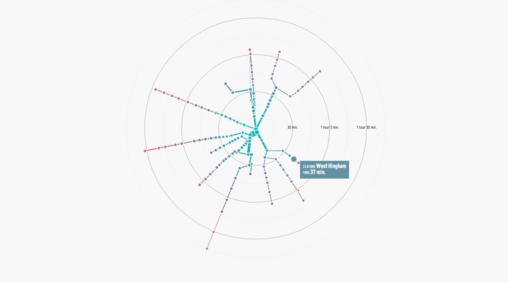

These recent projects and sketches grew as speculative offshoots of other projects, exploring the intersection of new technologies (sentiment analysis, luma.gl) and existing problems.

	<iframe src="https://www.useloom.com/embed/162456d36d5b4f1cb07b42d789492e8f" frameborder="0" allowfullscreen></iframe>

