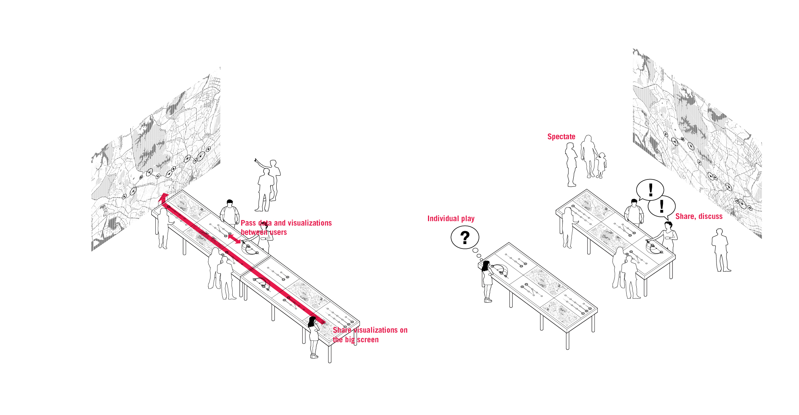
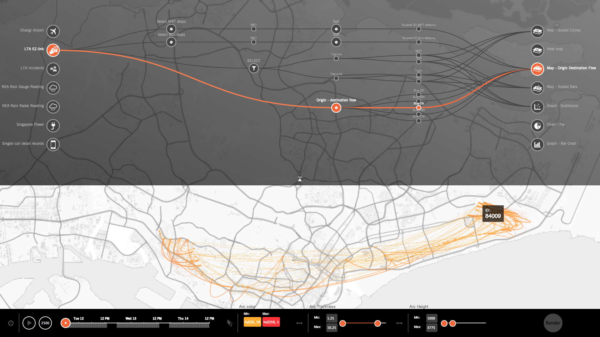
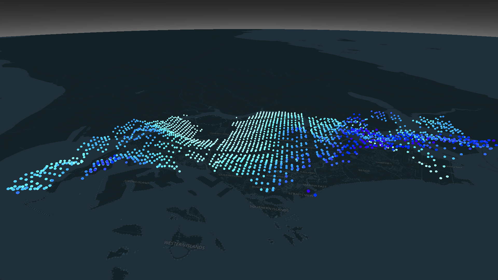

Massive datasets from Singapore's transportation, energy, and communication systems are made publicly available for the first time in MIT's interactive exhibition at the National Museum of Singapore. Visitors are able to compose their own visual story of how the city works through an intuitive user interface, built off of MIT's ongoing [DataCollider](http://datacollider.io/) project.

