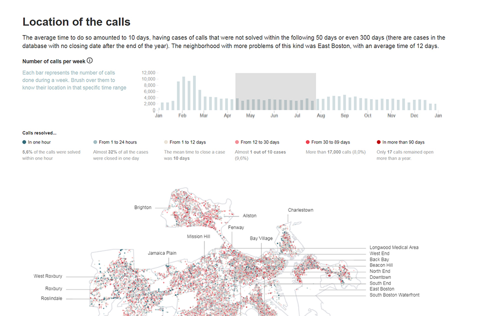
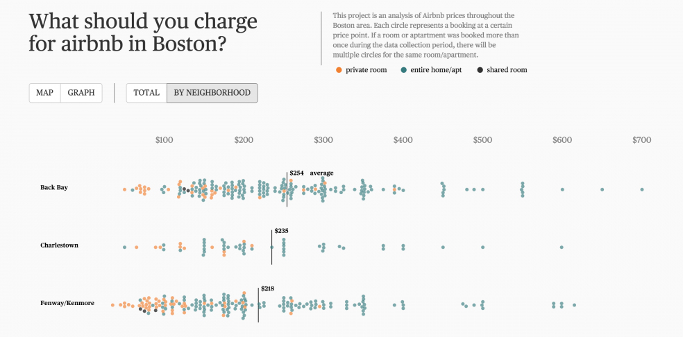
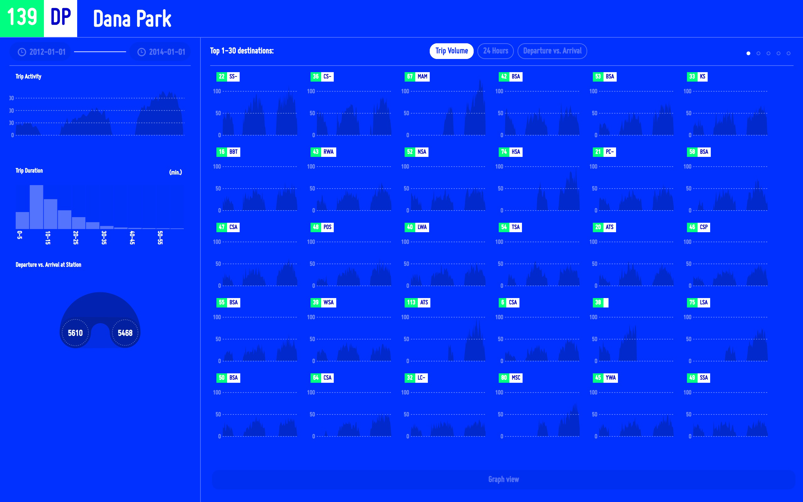

My graduate-level classes in information design and visualization at Northeastern University teach students from diverse backgrounds in journalism, science, and design how to operationalize information design best practices with the latest frontend technologies (d3, ES6 etc.). In the advanced classes, I have worked with students to study urban complexity and equity through the lens of information design. Student projects have examined a broad range of issues including municipal service provision (311), Airbnb, usage patterns of bike share programs, and housing affordability.

