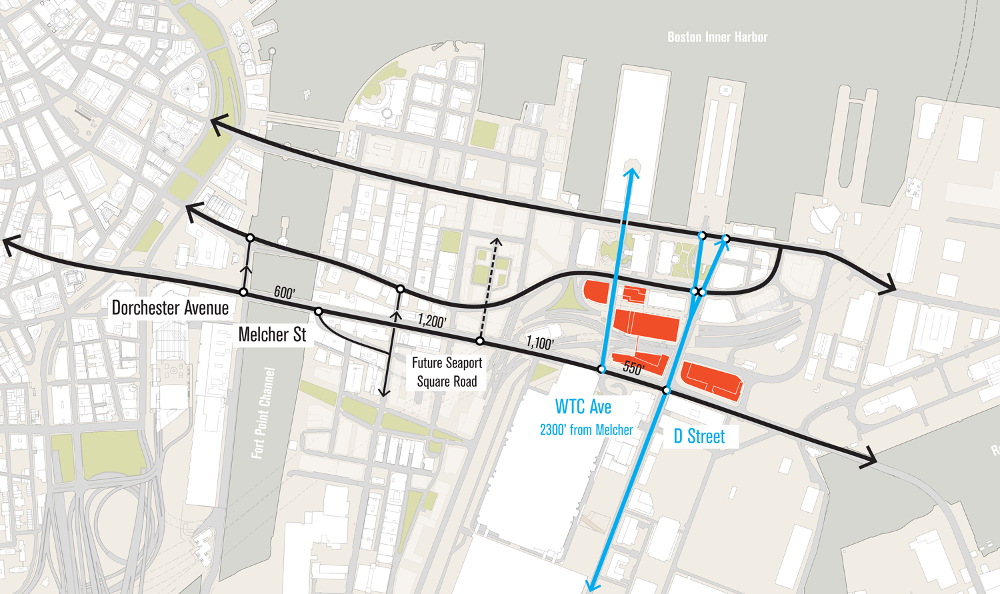
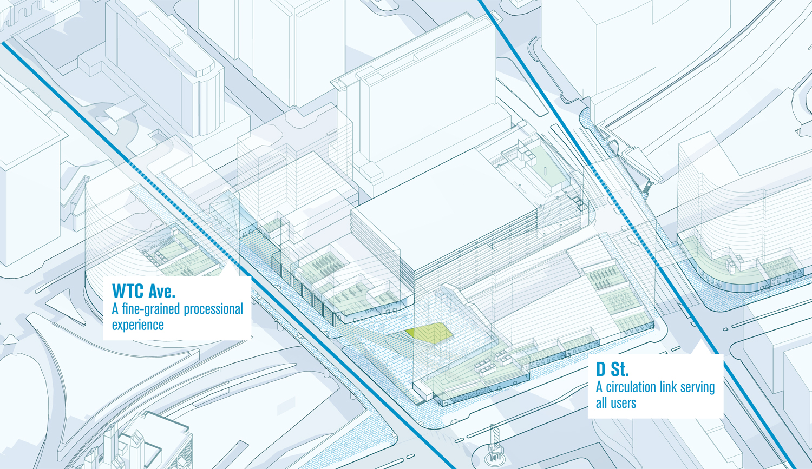
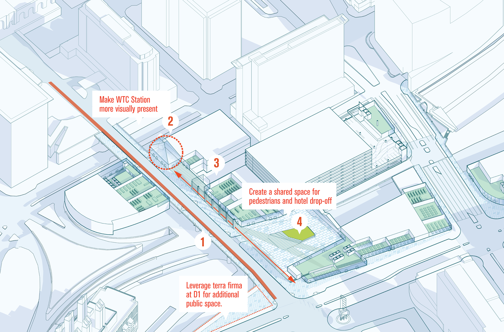
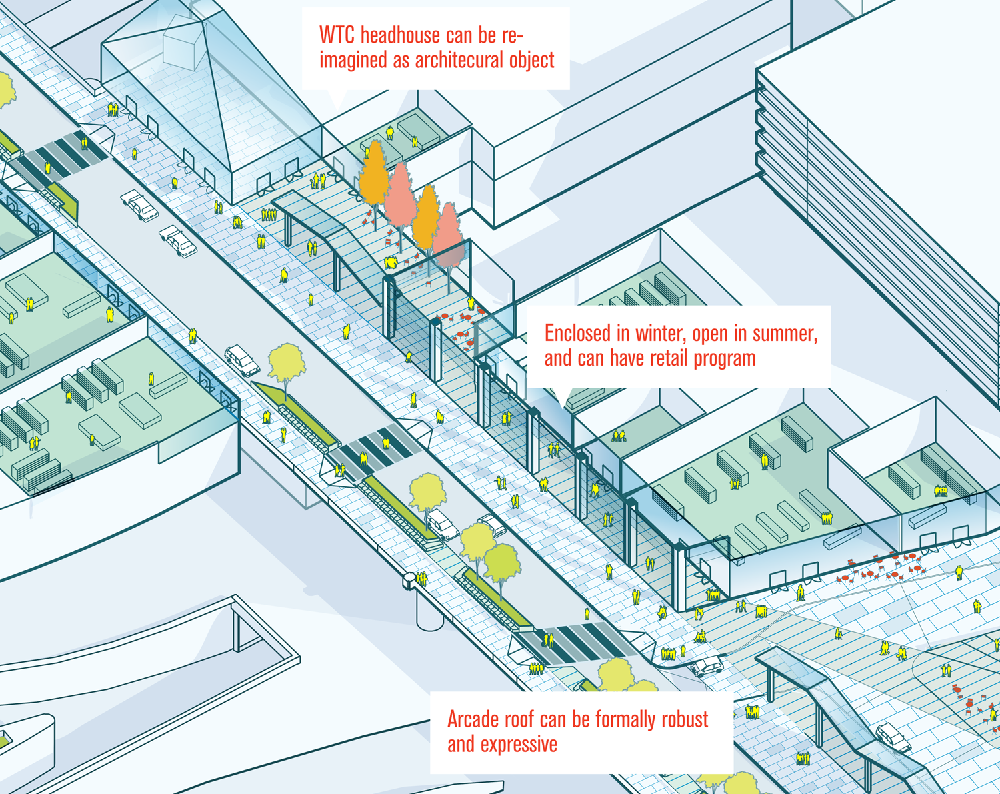
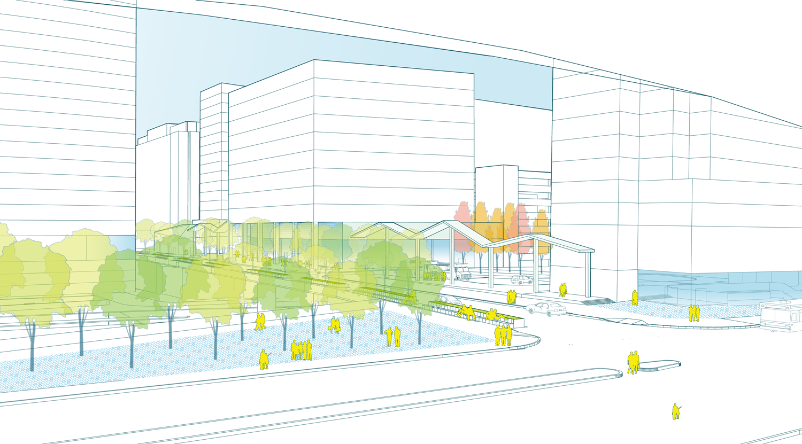
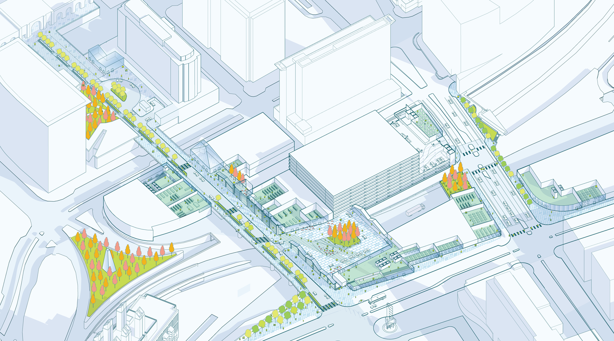

As project manager at [Utile](http://www.utiledesign.com), I worked with Massport, the public authority that manages much of the public land in Boston’s Seaport area, to develop conceptual designs for a system of indoor and outdoor public spaces that provide a framework for significant new development in the coming years.

